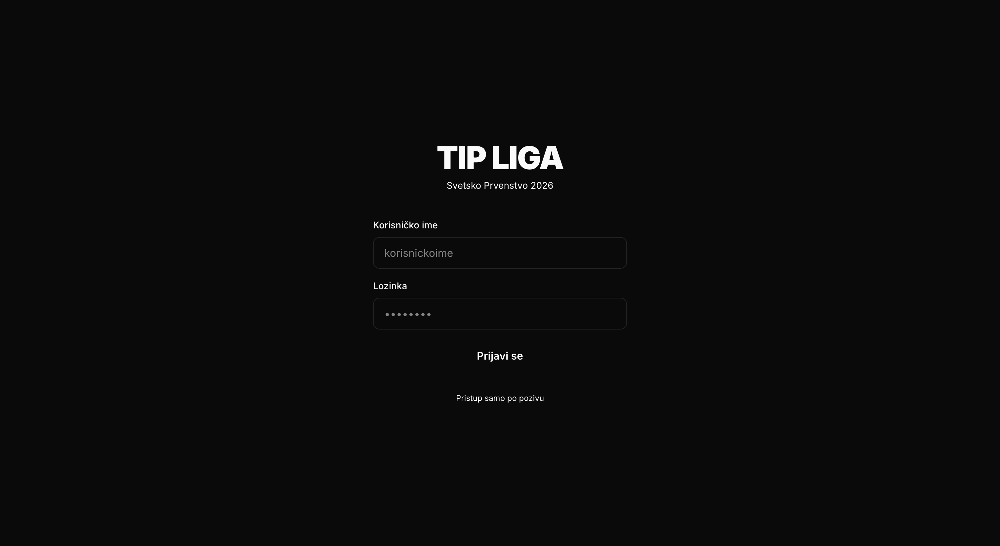
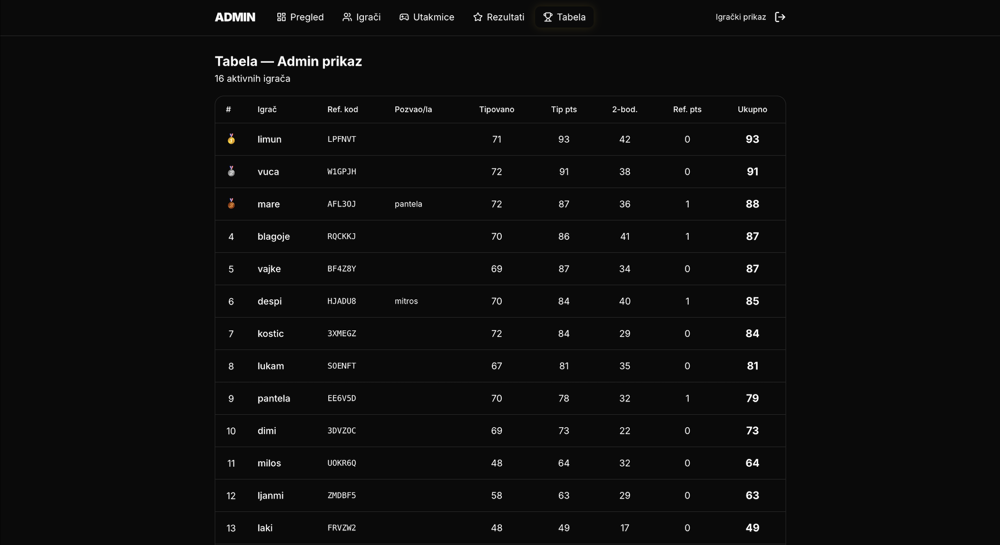
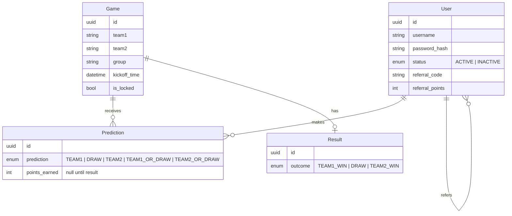

<div align="center">

# ⚽ TipLiga

**A private prediction league for the FIFA World Cup 2026, built for a group of friends.**

Players pick match outcomes, earn points as results come in, and compete for a shared prize pool on a live leaderboard.


### [ Live app → tipliga-hazel.vercel.app](https://tipliga-hazel.vercel.app/login)

<sub>Invite-only: accounts are created by the admin, so there's no public sign-up.</sub>

</div>

## Screenshots

<p align="center">
  
  
</p>
<p align="center">
  <sub><b>Left:</b> invite-only login. <b>Right:</b> admin leaderboard from the live 2026 tournament, with 16 players, referral codes, prediction points, the 2-point tiebreaker and totals.</sub>
</p>

---

## About the project

TipLiga (from *tip*, Serbian slang for a bet or prediction) is a real application I built and ran for my friends during the 2026 World Cup group stage. It is a closed, invite-only league: there is no public sign-up. An admin creates accounts, adds matches, locks them at kickoff, and enters final results. The app handles everything else, including scoring, rankings, referral bonuses and the prize-pool breakdown.

I built it end to end: the data model, authentication, business logic, admin tooling and a mobile-first UI. Most players use it on their phones, so every screen is designed for small screens first.

> The UI is in Serbian because that's who the users are. The code, schema and this README are in English.

## Features

### For players
- **Betting slip ("listić")**: pick outcomes on several matches, review them in a slide-out drawer, then submit them all at once, the way a real sportsbook ticket works.
- **Five pick types per match**: home win, draw, away win, or a lower-risk *double chance* (home-or-draw, away-or-draw).
- **Personal dashboard**: current rank, a points breakdown (predictions + referrals), progress on open matches, and hit rate.
- **Live leaderboard**: standings with a tiebreaker, medals for the top 3, and the current player's row highlighted.
- **History view**: every past pick with its result and the points it earned, color-coded.
- **Referral program**: each player has a unique code; inviting a friend gives both players a bonus point (capped at 5).

### For the admin
- **Overview**: player counts, money collected, and the prize pool split (65 / 25 / 10 %).
- **Match management**: create fixtures for groups A–L and lock or unlock predictions per match.
- **Result entry**: record the outcome once and every player's points are recalculated automatically.
- **User management**: create accounts (with an optional referral code) and activate or deactivate players.

## Scoring rules

| Pick | Correct if the result is… | Points |
|---|---|:---:|
| Team 1 / Draw / Team 2 | exactly that outcome | **2** |
| Team 1 or Draw | Team 1 wins **or** a draw | **1** |
| Team 2 or Draw | Team 2 wins **or** a draw | **1** |
| Referral | per invited player (max 5) | **+1** |

**Tiebreaker:** number of correct 2-point picks. Tied players share a rank (standard competition ranking: 1, 2, 2, 4).

## Tech stack

| Layer | Technology |
|---|---|
| Framework | **Next.js 14** (App Router, React Server Components, Server Actions) |
| Language | **TypeScript** |
| Styling | **Tailwind CSS v4**, shadcn/ui, Base UI, lucide-react icons |
| Database | **PostgreSQL** hosted on Supabase |
| ORM | **Prisma 7** with the `@prisma/adapter-pg` driver adapter over a `pg` connection pool |
| Auth | Custom **JWT** sessions (`jose`), **bcrypt** password hashing, httpOnly cookies |
| Hosting | **Vercel** |

## Architecture & engineering highlights

- **Server-first design.** Pages are React Server Components that query the database directly. Mutations are Server Actions, so the app needs no hand-written REST layer beyond the login and logout endpoints. Client components are used only where interactivity is needed, such as the betting slip and filters.

- **Defense-in-depth authorization.** Middleware verifies the JWT on every request and blocks non-admins from `/admin/*`. Every Server Action also re-checks the session and role on the server, so a crafted request can't get past the UI.

- **Sliding sessions.** Tokens last 7 days. Middleware re-issues a fresh token after 3.5 days, so active players stay logged in while abandoned sessions still expire.

- **Consistent scoring.** Entering a result upserts the `Result` row and recalculates points for every prediction on that match inside **one database transaction**. Scoring is a pure function in [`lib/scoring.ts`](lib/scoring.ts). Correcting a wrong result is safe, because re-entering it simply recomputes every score.

- **Locks enforced on the server.** When a slip is submitted, the server keeps only picks for matches that are still unlocked. Nobody can predict after kickoff, even by bypassing the UI. A composite unique key on `(user_id, game_id)` allows editing a pick with a single upsert.

- **Serverless-friendly database access.** Runtime queries go through Supabase's connection pooler, while a separate direct connection string is used for schema changes. The Prisma client is kept as a singleton to avoid exhausting connections during development hot reloads.

## Data model



## Project structure

```
app/
├── (auth)/login/          # Login page
├── (app)/                 # Player area (protected)
│   ├── dashboard/         # Rank, points, progress
│   ├── predictions/       # Match cards, betting slip drawer, history
│   ├── leaderboard/       # Standings table
│   └── profile/           # Referral code & stats
├── admin/                 # Admin area (role-protected)
│   ├── games/             # Create & lock matches
│   ├── results/           # Enter results → auto-scoring
│   ├── users/             # Create & (de)activate players
│   └── leaderboard/
└── api/auth/              # Login / logout route handlers
lib/
├── auth.ts                # JWT sign / verify, session helper
├── scoring.ts             # Points calculation (pure function)
├── standings.ts           # Leaderboard aggregation & ranking
└── prisma.ts              # Prisma client singleton
middleware.ts              # Route protection + sliding session renewal
prisma/schema.prisma       # Database schema
```

## Running locally

**Prerequisites:** Node.js 20+ and a PostgreSQL database (local or Supabase).

```bash
# 1. Install dependencies
npm install

# 2. Configure environment
cp .env.example .env.local
#    then fill in the values (see below)

# 3. Create the database tables and generate the Prisma client
npx prisma db push
npx prisma generate

# 4. Start the dev server
npm run dev
```

Open [http://localhost:3000](http://localhost:3000) and log in with the admin credentials from your env file. From there you can create players and matches.

### Environment variables

| Variable | Description |
|---|---|
| `DATABASE_URL` | Pooled Postgres connection string used at runtime |
| `DIRECT_URL` | Direct Postgres connection string used for schema changes |
| `JWT_SECRET` | Long random string used to sign session tokens |
| `ADMIN_USERNAME` | Admin login username |
| `ADMIN_PASSWORD` | Admin login password |

## What I'd build next

- Unit tests for the scoring and ranking logic (both are pure functions, so easy to test)
- Automatic locking at kickoff time via a scheduled job
- Support for knockout-stage matches (extra time and penalties)
- Result history / audit log for admin corrections

## Author

**Dimitrije Stasic** · [GitHub @stasdi01](https://github.com/stasdi01)
